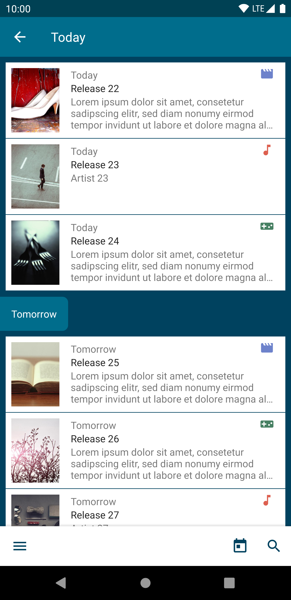

# Release Report

[](https://www.repostatus.org/#wip) [](https://github.com/Faltenreich/Release-Report/releases)
[](https://www.gnu.org/licenses/gpl-3.0)

 

Release Report is an Android app that shows release dates for upcoming media.

It merges movies, music and video games into one cohesive user experience. Thanks to different kinds of dashboards, the user has always the complete overview about what is next in the world of entertainment. Additionally one can subscribe to specific releases in order to be reminded about their release when their time has come.

* Get a glance of recent and upcoming movies, music albums and video games
* Read through descriptions and watch images or trailers of releases as soon as they become available
* Subscribe to releases that you are interested in to get notified upon their release date
* Get weekly updates about upcoming releases
* Browse hundreds of releases via full text search

      

## Development

#### Setup

1. Complete setup for [Release Report Sync](https://github.com/Faltenreich/Release-Report-Sync)
2. Clone or fork this repository
3. Open project via Android Studio
4. Create local.properties in the root directory with following properties from your [Parse Server](https://parseplatform.org) Core Settings:

    ```
    parse.serverUrl = "<Parse API Address>"
    parse.applicationId = "<App Id>"
    parse.clientKey = "<Client Key>"
    ```

5. Gradle Sync
6. Build

#### Third-party licenses

This software uses following technologies with great appreciation:

* [AboutLibraries](https://github.com/mikepenz/AboutLibraries)
* [AndroidX](https://developer.android.com/jetpack/androidx)
* [Glide](https://github.com/bumptech/glide)
* [JUnit](https://junit.org)
* [Kotlin](https://kotlinlang.org)
* [Kotlinx](https://ktor.io/kotlinx)
* [Material Components for Android](https://material.io/components)
* [MonthAndYearPicker](https://github.com/premkumarroyal/MonthAndYearPicker)
* [Parse SDK for Android](https://github.com/parse-community/Parse-SDK-Android)
* [ScrollGalleryView](https://github.com/VEINHORN/ScrollGalleryView)
* [SearchView](https://github.com/lapism/SearchView)
* [SkeletonLayout](https://github.com/Faltenreich/SkeletonLayout)
* [ThreeTenABP](https://github.com/JakeWharton/ThreeTenABP)

These dependencies are bundled under the terms of their respective license.

## Donations

If you want to buy me a beer or support me in general, please use the donate button and be aware of my thanks.

<a href="https://www.paypal.com/cgi-bin/webscr?cmd=_s-xclick&hosted_button_id=AM6HG633T4BWY&source=url">
 
</a>

## Legal

#### Redistribution

Additionally to the permissions, conditions and limitations of the GPLv3, the permission for redistribution must be manually requested in advance. This ensures that neither the original software or any fork will be affected negatively by terms and conditions like the [Google Play Developer Distribution Agreement](https://play.google.com/about/developer-distribution-agreement.html). If you plan to redistribute this software, please contact the maintainer at [philipp.fahlteich@gmail.com](mailto:philipp.fahlteich@gmail.com).

#### License

    Copyright (C) 2020 Philipp Fahlteich

    This program is free software: you can redistribute it and/or modify
    it under the terms of the GNU General Public License as published by
    the Free Software Foundation, either version 3 of the License, or
    (at your option) any later version.

    This program is distributed in the hope that it will be useful,
    but WITHOUT ANY WARRANTY; without even the implied warranty of
    MERCHANTABILITY or FITNESS FOR A PARTICULAR PURPOSE.  See the
    GNU General Public License for more details.

    You should have received a copy of the GNU General Public License
    along with this program.  If not, see <https://www.gnu.org/licenses/>.
